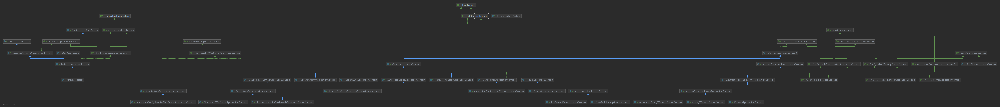
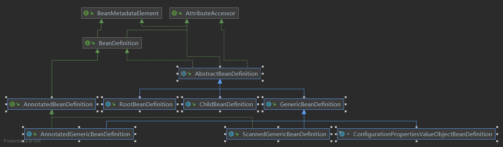

#此项目主要是手写IOC、DI、MVC功能:

###1.IOC:
####[1]顶层BeanFactory继承关系(查看继承关系的方法,shift+ctrl+alt+u打开类,鼠标左键点击模块后 ctrl+alt+B,ctr+A全选 回车)
BeanFactory的作用主要提供接口获取Bean,例如ApplicationContext需要继承BeanFactory使用其中的getBean()
####[2]beans配置封装模块-->BeanDefinition:

####[3]X_[AbstractApplicationContext]为 IOC容器的顶层抽象类,由[BeanFactory.png]继承关系可得知,X实现了A_[ConfigurableApplicationContext],A继承了B_[ApplicationContext],B继承了C_[ListableBeanFactory, HierarchicalBeanFactory,],C继承了顶层的[BeanFactory]
    Mini版本只提供提供refresh()方法
####[4]类[DefaultListableBeanFactory]为IOC容器的典型类(非抽象),提供存储BeanDefinition的IOC容器Map,定义顶层缓存
####[5]类[ApplicationContext] 
        * ApplicationContext 是直接接触用户的入口，主要实现
        * DefaultListableBeanFactory 的 refresh（）方法和
        * BeanFactory的 getBean（）方法，完成IoC、 DI、 AOP的衔接
###2.DI:
